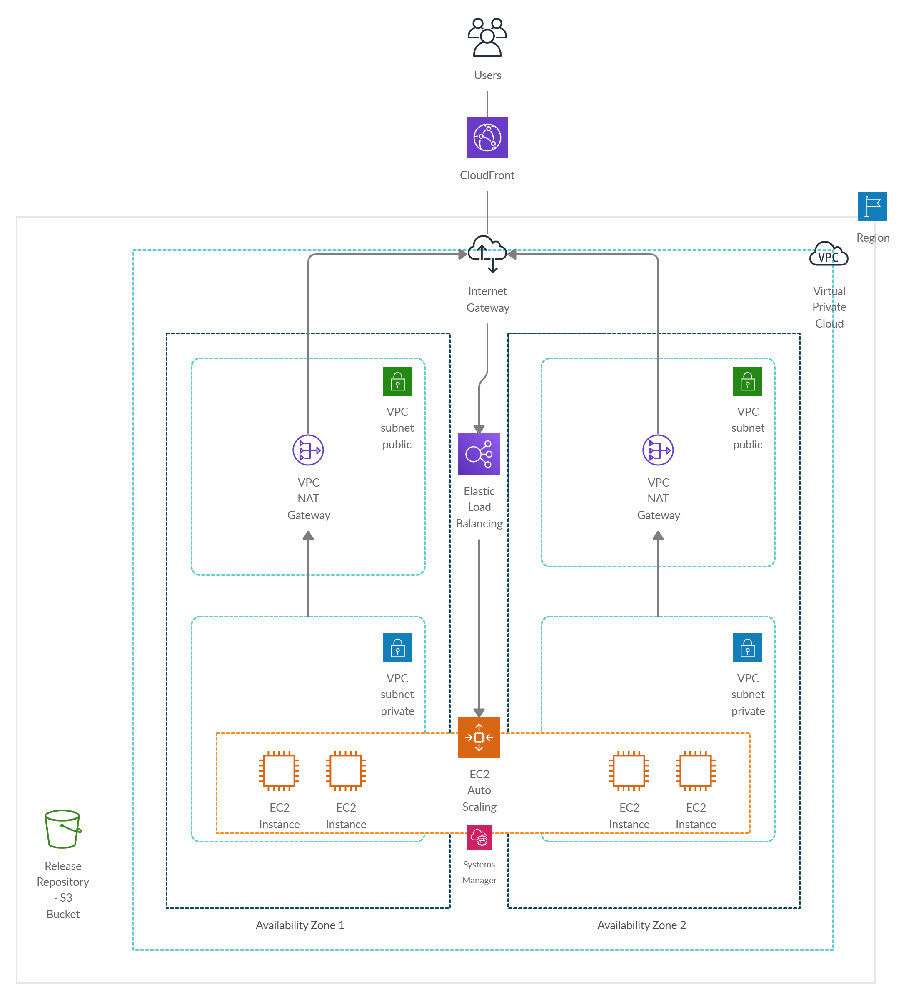

# aws-ec2-static-website-template

## OBJECTIVE
The purpose of this starter template is to demonstrate how a static website can be deployed and maintained in AWS.

### Audience
To showcase how applications can be deployed, I have used the following starter template: https://github.com/facebook/create-react-app. The deployment approach shown in this template does not depend on the type of framework chosen. You are free to choose any other kind of framework - angular, vue etc.

Once a framework is chosen, the next challenge for an organization is to define an approach for managing the web application in a cloud environment - AWS, Azure etc. Navigating a cloud envionment, say AWS, is not an easy task. There are considerations around security, performance, scalability, monitoring etc. This template showcases one way in which such an application can be deployed in AWS keeping in mind the best practices.

### Approach
There are multiple ways in which a static website can be deployed in AWS -
1. Deployment in EC2 server with cloud front integration
2. Deployment in S3 with cloud front integration and using API-Gateway / Lambda for APIs (a.k.a serverless approach)
3. Deployment usng Elastic Beanstalk
4. Deployment using LightSail
5. Deployment using ECS
6. Deployment using EKS
7. ...
8. ...

All the above approaches have their pros and cons. This template focuses on approach #1 for deploying and running the web application.

## TECHNICAL DETAILS
The template starts with a most basic installation setup in AWS required to run a 24*7 website - N EC2 servers running in different availability zones managed by a load balancer (refer diagram below).

In summary, the following infrastructure is being created:
1. EC2 servers deployed in different AZs registered with a load balancer.
2. Servers deployed in Auto Scaling Group to ensure the specified minimum number of servers are always active. 
3. EC2 servers running in private subnets to ensure instances are always secure.
4. Use of NAT Gateway to route EC2 server requests to internet (for getting updates or any additional request to the internet).
5. Enabling developer to remote into EC2 servers using AWS Systems Manager.
6. Use of Cloud watch for monitoring purposes.
7. Enabling CloudTrail to support auditing requirements.

For ease of customizing the infrastructure, the template provides infrastructure automation scripts using AWS Cloud Formation.

## HOW TO USE?

### Pre-requisites
In order to run the application, the following must be completed before initiating setup / deployment:
* Install Node 10 and above (https://nodejs.org/en/download/ or https://github.com/nvm-sh/nvm)
* Install AWS CLI Latest (https://aws.amazon.com/cli/)
* Setup AWS CLI profile, specify credentials as well as preferred region (https://docs.aws.amazon.com/cli/latest/userguide/cli-chap-configure.html)

### Installation Steps
Please follow the below steps:
* Update the infrastructure templates as per your requirement.
    * Once the changes are made, push the nested stack templates to a S3 public bucket of your choice.
    * Update the URL of these templates in master.yaml
    * Update UserData attribute in LaunchConfig node of application.yaml as per requirement.
    * Validate the template using "npm run stack:validate"
* Update the "aws" attribute in package json with configuration specific details
    * Stack name for setting up the cloudformation stack
    * AWS profile to be used while invoking the cloudformation 
* Update the "web" folder with code required to run your web application. Note that the following steps are custom to the "react-boilerplate-typescript" template
    * Run "cd web"
    * Run "npm run build"
* To deploy the application, run the following command:
    * Run "npm install" to install the dependencies
    * To deploy the application for first time, run "npm run deploy"
    * For installing updates, run "npm run update"
* The URL of the deployed application is available in cloudformation stack output.